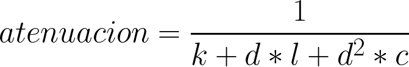

El efecto de atenuación es una propiedad de la luz en la cual pierde intensidad cuanto más se aleja de la fuente. Si se modela mediante el comportamiento físico, se obtiene que la intensidad de la luz decae con el inverso del radio al cuadrado. Pero si se realiza de esta manera se puede ver que la luz disminuye muy rápido. por lo cual se utiliza la atenuación proporcional al inverso del radio. Para este caso en particular se utilizó lightFalloff() de P5.js, el cual lo calcula mediante la siguiente formula:

en donde:
- k es la constante de decaimiento constante
- l es la constante de decaimiento lineal
- c es la constante de decaimiento cuadrático
- d es la distancia entre el objeto y la fuente de luz

para el funcionamiento, mueva el mouse para mover el punto de luz, y para cambiar las constantes deslice los slider de la parte de abaje, el primero referencia la constante, el segundo la constante lineal, y el tercero la constante cuadrática. La constante lineal esta reescalada en un factor de 1/1000, y la cuadrática en un factor de 1/10000. Todo esto para evitar la atenuación exagerada de la luz.

