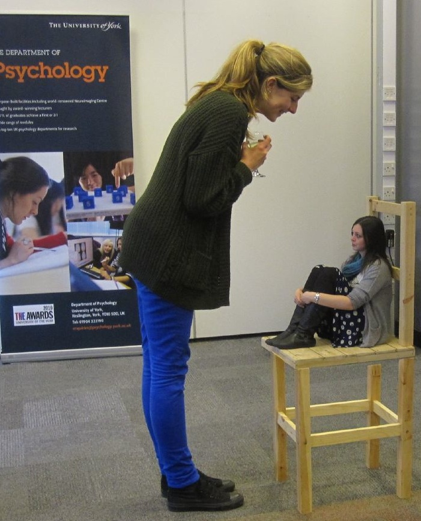

La ilusión óptica creada por la Silla de Beuchet es una ilusión óptica que juega con nuestra percepción visual, gracias a que nuestro cerebro piensa que las cosas que se alinean perfectamente en el mundo realmente son de esta manera. Pero esta ilusión funciona separando las patas y el asiento, por una gran distancia por lo cual, el asiento de la silla se encuentra a una distancia mucho más grande que las patas, por este mismo motivo debe ser más grande, para mantener las dimensiones. Luego debemos pararnos en el sitio correcto para que la silla parezca una pieza completa.

Como esto de tener un espaldar muy grande y unas patas más pequeñas o normales no es nada intuitivo el cerebro une las partes y crea nuestra Silla de Beuchet.

Aquí se puede observar una imagen mostrando la ilusión óptica, pareciera que las personas tienen una diferencia de tamaño muy grande, pero lo cierto es que no es así:

A continuación, se implementa un canvas mostrando la ilusión en el cual se puede observar la silla de manera normal, pero si se desliza el mouse de manera horizontal, se logra percibir que son dos piezas separadas y una de mayor tamaño que la otra:

