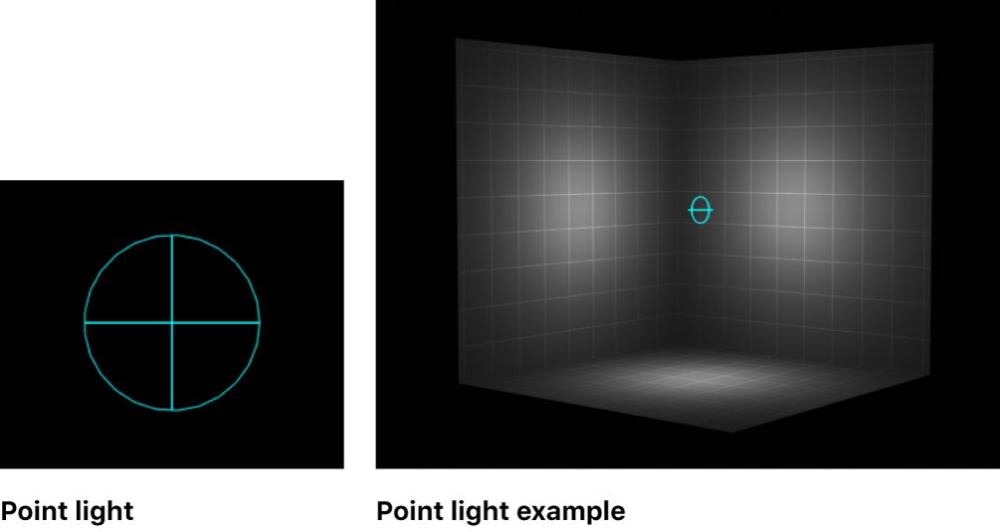

Para generar la luz ambiental que vemos en la animación de más abajo, se utilizó el lightpoint() de P5.js, gracias a este se puede emitir luz haci afuera desde un punto definido por el movimiento del mouse en los ejes x e y, y estatico en el eje z a una distancia de 25px del borde de la esfera más grande. 

imagen tomada de: https://support.apple.com/es-co/guide/motion/motn17c66a87/mac

la definición de P5 para el punto es pointLight(v1, v2, v3, x, y, z), donde:

- v1 Número|Arreglo|String|p5.Color: valor de gris, rojo o tinte (dependiendo del modo de color actual), o arreglo de color o String de color CSS
- v2 Número: opcional, valor de verde o saturación
- v3 Número: opcional, valor de azul o brillo
- x Número|p5.Vector: dirección del eje x o un p5.Vector
- y Número: opcional, dirección del eje y
- z Número: opcional, dirección del eje z

mueve el mouse para mover el punto de luz e iliminar de diferente manera las figuras.

