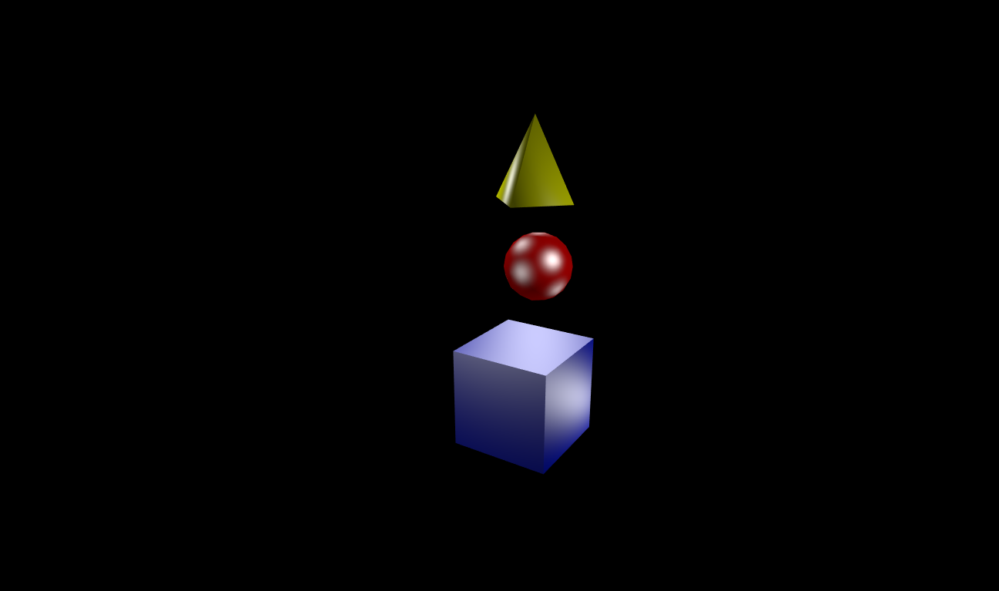

Para esta parte del taller se utilizó una librería para javascript llamada Three js la cuál nos permite hacer cosas más complejas pero con un poco de ayuda por parte de la librería.

para este ejersicio se pidió usar 8 funtes de luz, para esto usamos luces puntuales las cuales tienen un comportamiento similar a estar afiliadas a nub-nodes.

se usaron las figuras anteriores reorganizadas y se ubicaron las luces de manera estratégica además se usó iluminación pixel a pixel para hacer más claras ñas funtes de luz.

