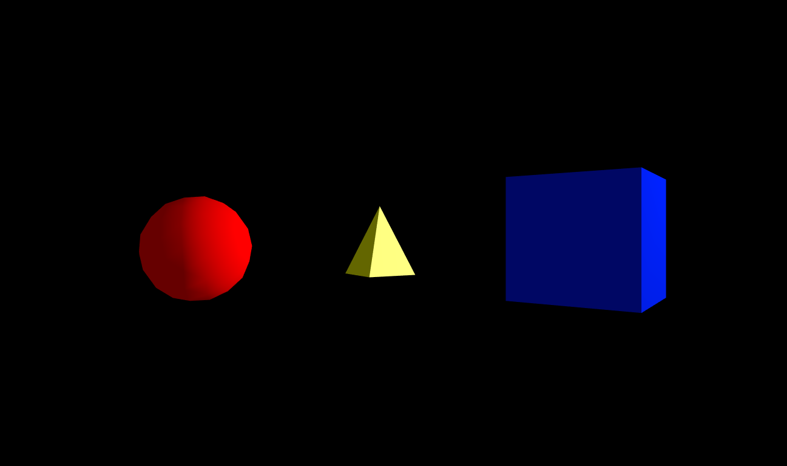
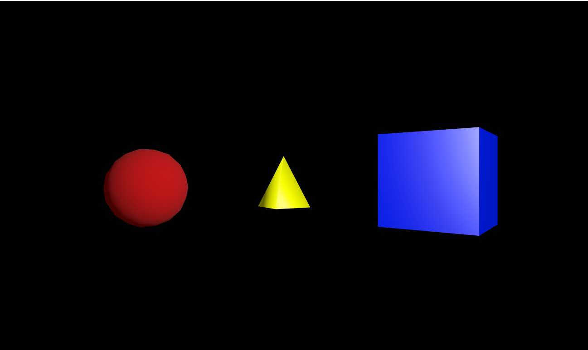

Para esta parte del taller se utilizó una librería para javascript llamada Three js la cuál nos permite hacer cosas más complejas pero con un poco de ayuda por parte de la librería.

Para la implementación de los 3 tipos de luces la luz ambiental es la clásica por parte de la librería.

Para la luz difusa y la especular, la librería coloca este tipo de efectos directamente en el material de los objetos por lo que se observa una esfera con luz difusa resaltada, una piramide con luz especular resaltada y por último un cubo haciendo uso de ambos.

Primero observaremos el ejemplo haciendo uso de per-vertex shader:

Y luego lo observamos con per-pixel shader

la principal diferencia se puede ver en la esfera pues se notan un poco los triangulos que la conforman haciendo uso de per-vertex.