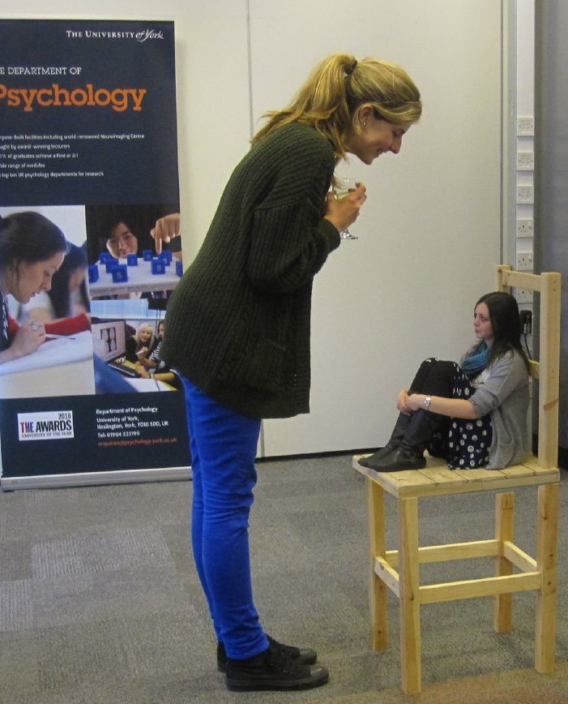

La ilusión Ebbinghaus o tambien llamada circulos Titchener es una ilusión optica de percepción de tamaño relativo, llamada asi por su descubridor, el psicologo alemán Hermann Ebbinghaus (1850–1909), la ilusión fue popularizada por Edward B. Titchener en un libro de psicologia experimental en 1901, por ello tiene su nombre alternativo.

En esta ilusión dos circulos de igual tamaño se ponen de manera cercana, uno es rodeado por circulos grandes, mientras el otro es rodeado por circulos pequeños.

Como resultado de la juxtaposición de los circulos, el circulo central rodeado de circulos grandes parece ser mas pequeño que el circulo rodeado de circulos pequeños, cuando en realidad son de igual tamaño

Aqui se puede observar un imagen mostrando la ilusión optica:

Trabajo reciente sugiere que otro factor critico envuelto en la percepción de la ilusión Ebbinghaus es la distancia de los circulos que rodean al circulo central. Sin importar el tamaño relativo, si los circulos que rodean al circulo central estan mas cerca a este, hacen que el circulo central parezca mas grande, y si estan mas lejos parece mas pequeño de su verdadero tamaño.

A continuación se implementa un canvas mostrando la ilusión en el cual se puede observar que el tamaño de los circulos es igual al mover el puntero de manera horizontal:

