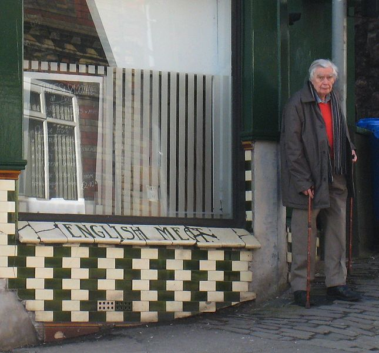

La ilusión Café Wall, es una ilusión óptica-geométrica en la cual líneas paralelas que dividen filas con "ladrillos" blancos y negros que se alternan y hacen que las líneas paralelas parezcan inclinadas cuando no lo son.

Fue descrita primeramente bajo el nombre de la ilusión Kindergarten en 1898, y fue redescubierta en 1973 por Richard Gregory. De acuerdo a Gregory, este efecto fue observado por un miembro de su laboratorio, Steve Simpson, en las baldosas de la pared de un café en St Michael's Hill, Bristol. Es una variante de la ilusion del tablero de ajedrez corrido originada por Hugo Münsterberg.

En la construcción de la ilusión óptica cada "ladrillo" esta rodeado por una capa de "mortero" intermedio entre los colores claros y oscuros de los "ladrillos".

En el primer intento de su deconstrucción, la ilusión fue atribuida a la ilusión de irradiación (un mayor tamaño aparente de un area blanca que una area negra), y la imagen desaparece cuando blanco y negro son reemplazados por colores diferentes del mismo brillo. Pero un componente de la ilusión queda aun cuando todos los componentes opticos y retinales estan factorizados. Polaridades de contraste parecen ser el factor determinante en la dirección de la inclinación.

Aqui se puede ver una imagen estatica de la ilusion:

En la siguiente imagen se puede ver a Richard Gregory la pared del café original en St Michael's Hill, Bristol en Febrero del 2010.

A continuación se puede ver un canvas en la cual se puede interactuar con la ilusión:

