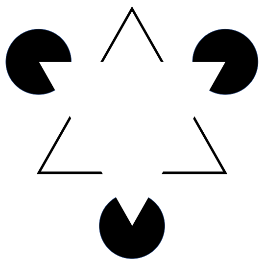

Imágenes ambiguas o figuras reversibles son imágenes con ilusiones ópticas las cuales explotan similitudes gráficas y otras propiedades de la interpretación del sistema visual entre dos o más formas distintas de imágenes. Son famosas por inducir el fenómeno de la percepción multiestable. 

La percepción multiestable es el momento cuando una imagen es capaz de proveer múltiples percepciones estables.

Las imágenes ambiguas son importantes dentro del campo de la psicología porque a menudo son herramientas de búsqueda en experimentos.

Una de las imagenes ambiguas mas famosas son las imagenes de Kanizsa, estas son imagenes que fueron popularizadas por Gaetano Kanizsa. Estas imagenes dan la ilusion de que una forma geometrica existe en la imagen.

A continuación se muestra la imagen de kanizsa mas famosa. El triangulo de kanizsa:

Como se puede observar esta imagen da la ilusión de que existe un triangulo blanco en la imagen cuando este no es el caso.

Y ahora se implementara en un canvas una ilusión de un "cuadrado de kanizsa":

