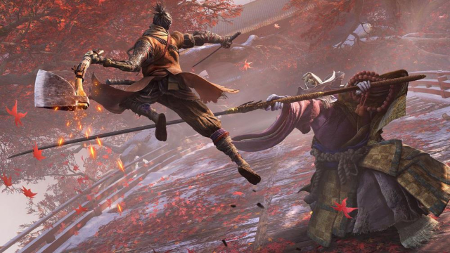

A lo largo de esta página, vamos a documentar el estudio realizado para extraer el histograma de una imagen usango p5.js, las imagenes a analizar se pueden ir camiando mediante las letras:



- Letra "a": para mostrar la imagen de subnautica
- Letra "b": para mostrar la imagen de Assassin's Creed Unity
- Letra "c": para mostrar la imagen de Assassin's Creed Oddysey
- Letra "d": para mostrar la imagen de Minecraft
- Letra "e": para mostrar la imagen de Sekiro: Shadows Die Twice

El metodo utilizado para realizar el análisis es iterar por cada uno de los pixeles en la imagen y guardar sus propiedades en arreglos de 256 posiciones. Cada elemento de estos nos indica cuántos pixeles tienen el nivel de brillo, 
rojo, verde o azul igual al valor de la posición del arrelgo en la cual se encuentra. Cada valor de los arreglos se grafica en el histograma utilizando el método .line()

El código utilizado para realizar lo descrito anteriormente y obtener el histograma de la imagen seleccionada es el siguente:

```js
let img;
let mask;
let Bhist = false;
let BhistR = true;
let BhistG = false;
let BhistB = false;
let hist = [];
let histR = [];
let histG = [];
let histB = [];
let histGMax;
let histRMax;
let histBMax;

function preload() {
  img = loadImage('../images/sekiro.jpg');
}

function setup() {
  width = img.width;
  height = img.height;

  h1 = createElement("h1", "Levels Histogram");
  h1.style("z-index", 50);
  h1.style("x-index", 150);
  h1.style("x-index", width / 2);

  createCanvas(width, height);

  img.loadPixels();

  background(255);
  var pixelBrt = [0];
  for (i = 0; i < 255; i++) {
    pixelBrt[i] = 0;
  }
  
  for (var i = 0; i < img.width; i++) {
    for (var j = 0; j < img.height; j++) {
      pixel = img.get(i, j);
      pixelBrt[int(brightness(pixel))]++;
      histR[int(red(pixel))]++;
      histG[int(green(pixel))]++;
      histB[int(blue(pixel))]++;
    }
  }
  
  var maxPixels = 0;
  for (i = 0; i < 255; i++) {
    if (pixelBrt[i] > maxPixels) {
      maxPixels = pixelBrt[i];
    }
  }

  for (i = 0; i < 255; i++) {
    h = map(pixelBrt[i], 0, maxPixels, 0, height - img.height-10)
    fill(i, i, i);
    rect(0 + (i * (width / 255)), height, width / 255, -h);
  }

  image(img, 0, 0);
}

function draw() {

}
```
<div class="histograma" id='histograma'></div>