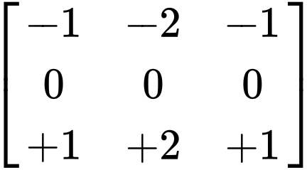

Como lo indica el titulo, vamos a transformar una imagen con la matríz o máscara de convolución Sobel Bottom, la cual esta representada de esta manera:



Esta es la imagen que vamos a transformar, como podemos observar esta es una imagen de un Tigre.


y ahora procedemos a transformar esta imagen con la matriz de convolución usando el siguiente script:

```js
var srcimg, dstimg;

function preload() {
  srcimg = loadImage("../images/Tiger.jpg");
}

function setup() {
  var myCanvas = createCanvas(srcimg.width, srcimg.height);
  myCanvas.parent("sobel-bottom");
  pixelDensity(1);
  dstimg = createImage(srcimg.width, srcimg.height);
}

function draw() {
  processImage(srcimg, dstimg);
  image(dstimg, 0, 0, dstimg.width, dstimg.height);
}

function processImage(_srcimg, _dstimg) {
  var k1 = [
    [-1, -2, -1],
    [0, 0, 0],
    [1, 2, 1],
  ];

  _srcimg.loadPixels();
  _dstimg.loadPixels();

  var w = _srcimg.width;
  var h = _srcimg.height;
  for (var x = 0; x < w; x++) {
    for (var y = 0; y < h; y++) {
      var ul = (((x - 1 + w) % w) + w * ((y - 1 + h) % h)) * 4;
      var uc = (((x - 0 + w) % w) + w * ((y - 1 + h) % h)) * 4;
      var ur = (((x + 1 + w) % w) + w * ((y - 1 + h) % h)) * 4;
      var ml = (((x - 1 + w) % w) + w * ((y + 0 + h) % h)) * 4;
      var mc = (((x - 0 + w) % w) + w * ((y + 0 + h) % h)) * 4;
      var mr = (((x + 1 + w) % w) + w * ((y + 0 + h) % h)) * 4;
      var ll = (((x - 1 + w) % w) + w * ((y + 1 + h) % h)) * 4;
      var lc = (((x - 0 + w) % w) + w * ((y + 1 + h) % h)) * 4;
      var lr = (((x + 1 + w) % w) + w * ((y + 1 + h) % h)) * 4;

      var p0 = _srcimg.pixels[ul + 1] * k1[0][0];
      var p1 = _srcimg.pixels[uc + 1] * k1[0][1];
      var p2 = _srcimg.pixels[ur + 1] * k1[0][2];
      var p3 = _srcimg.pixels[ml + 1] * k1[1][0];
      var p4 = _srcimg.pixels[mc + 1] * k1[1][1];
      var p5 = _srcimg.pixels[mr + 1] * k1[1][2];
      var p6 = _srcimg.pixels[ll + 1] * k1[2][0];
      var p7 = _srcimg.pixels[lc + 1] * k1[2][1];
      var p8 = _srcimg.pixels[lr + 1] * k1[2][2];
      var r1 = p0 + p1 + p2 + p3 + p4 + p5 + p6 + p7 + p8;

      var result = r1;

      _dstimg.pixels[mc] = result;
      _dstimg.pixels[mc + 1] = result;
      _dstimg.pixels[mc + 2] = result;
      _dstimg.pixels[mc + 3] = 255;
    }
  }

  _dstimg.updatePixels();
}
```
Finalmente como resultado obtenemos la imagen transfromada usando la matriz de Sobel Bottom.

<div class="sketch-matrix" id='sobel-bottom'></div>
