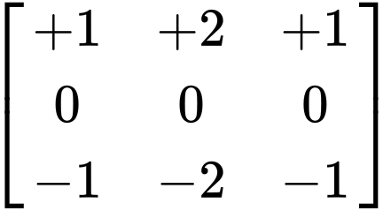

Como lo indica el titulo, vamos a transformar una imagen con la matríz o máscara de convolución Sobel Top, la cual esta representada de esta manera:



Esta es la imagen que vamos a transformar, como podemos observar esta es una imagen de un Tigre.


y ahora procedemos a transformar esta imagen con la matriz de convolución usando el siguiente script:

```js
var source_image, dest_image;

function preload() {
  source_image = loadImage("../images/Tiger.jpg");
}

function setup() {
  var myCanvas = createCanvas(source_image.width, source_image.height);
  myCanvas.parent("sobel-top");
  pixelDensity(1);
  dest_image = createImage(source_image.width, source_image.height);
}

function draw() {
  processImage(source_image, dest_image);
  image(dest_image, 0, 0, dest_image.width, dest_image.height);
}

function processImage(_source_image, _dest_image) {
  var k1 = [
    [1, 2, 1],
    [0, 0, 0],
    [-1, -2, -1],
  ];

  _source_image.loadPixels();
  _dest_image.loadPixels();

  var w = _source_image.width;
  var h = _source_image.height;
  for (var x = 0; x < w; x++) {
    for (var y = 0; y < h; y++) {
      var ul = (((x - 1 + w) % w) + w * ((y - 1 + h) % h)) * 4;
      var uc = (((x - 0 + w) % w) + w * ((y - 1 + h) % h)) * 4;
      var ur = (((x + 1 + w) % w) + w * ((y - 1 + h) % h)) * 4;
      var ml = (((x - 1 + w) % w) + w * ((y + 0 + h) % h)) * 4;
      var mc = (((x - 0 + w) % w) + w * ((y + 0 + h) % h)) * 4;
      var mr = (((x + 1 + w) % w) + w * ((y + 0 + h) % h)) * 4;
      var ll = (((x - 1 + w) % w) + w * ((y + 1 + h) % h)) * 4;
      var lc = (((x - 0 + w) % w) + w * ((y + 1 + h) % h)) * 4;
      var lr = (((x + 1 + w) % w) + w * ((y + 1 + h) % h)) * 4;

      var p0 = _source_image.pixels[ul + 1] * k1[0][0];
      var p1 = _source_image.pixels[uc + 1] * k1[0][1];
      var p2 = _source_image.pixels[ur + 1] * k1[0][2];
      var p3 = _source_image.pixels[ml + 1] * k1[1][0];
      var p4 = _source_image.pixels[mc + 1] * k1[1][1];
      var p5 = _source_image.pixels[mr + 1] * k1[1][2];
      var p6 = _source_image.pixels[ll + 1] * k1[2][0];
      var p7 = _source_image.pixels[lc + 1] * k1[2][1];
      var p8 = _source_image.pixels[lr + 1] * k1[2][2];
      var r1 = p0 + p1 + p2 + p3 + p4 + p5 + p6 + p7 + p8;

      var result = r1;

      _dest_image.pixels[mc] = result;
      _dest_image.pixels[mc + 1] = result;
      _dest_image.pixels[mc + 2] = result;
      _dest_image.pixels[mc + 3] = 255;
    }
  }

  _dest_image.updatePixels();
}
```

Finalmente como resultado obtenemos la imagen transfromada usando la matriz de Sobel Top.

<div class="center-text">

<b>Si quieres aumentar el efecto de la convolución haz click en la imagen.</b>

</div>

<div class="sketch-matrix" id='sobel-top'></div>
